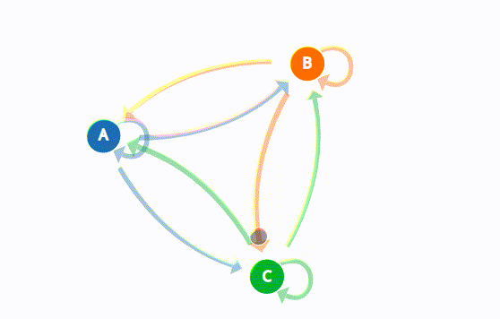

# Markov Chain Text Generator
This app is a full-stack implementation for text-generation using a Stochastic Modeling called **Markov Chain**.  This app is in React JS and Spring web MVC. This page gives a high-level undestanding of the app and how to use it. For installing and configuring backend and frontend individually, there are specific readme files in their own directory: 

[Configuring frontend](https://github.com/makhshari/markovchain/tree/main/frontend)

[Configuring backend](https://github.com/makhshari/markovchain/tree/main/backend)


# About the App


## How to use this app
There are two ways to use this app:
### Web Application (frontend + backend)

As it is shown in the GIF above, you can use it as a web application. All you need to do is to enter a story (and its' name), and tune three hyperparameters:

- Number of words as prefix.
- Number of words as postfix.
- Number of words to generate.

** Please note that the input story and all of these fields are required as server is set to return ```error``` otherwise. We could set them to 1 as a default value, but this doesn't yield the best way to use the app.

** To get a better understanding of what these parameters mean, you need to read the next section.  

#### How to run web application:
1- Run backend server on your localhost following the instruction here: [Running backend server on localhost](https://github.com/makhshari/markovchain/tree/main/backend#run-the-server-on-localhost-api)

2- Have the frontend up and running following the instruction here: [Configuring frontend](https://github.com/makhshari/markovchain/tree/main/frontend)


** Note that if your server is not running on ```http://localhost:8080```, you need to set the new address in the frontend global variables.

### Only API 
After [running backend server on localhost](https://github.com/makhshari/markovchain/tree/main/backend#run-the-server-on-localhost-api), you can use the backend server as a general API and send request to it from other clients, such as Postman or your custom web client.

### Standalone Java Application
This option is good if your input is a text file as the frontend still does not have the uploading file feature (TBD). Currently the Java app supports ```.txt```,```.doc``` (TBD), and ```.docx```(TBD) formats, but the implementation is pretty flexible for adding more formats.  

The only thing you need to do for running it is to follow the steps for [running the server as a standalone Java application](https://github.com/makhshari/markovchain/tree/main/backend#run-as-a-standalone-app). You can simply put your input text file in the appropriate directory, run a CMD command with the mentioned required hyperparameters, and get the generated text on terminal.

# About Text Generation with Markov Chain
One of the [earlies works](https://ieeexplore.ieee.org/stamp/stamp.jsp?arnumber=1365979&casa_token=Nqa4vgScJ4MAAAAA:rFLaThFcnZ2P9mxIFHR77yQJikrxCGQBLaJtVVkQtE_mcqBO3jSljgZ830s3SESDnuEwgPOZJw) that use Markov models for text generation describes markov models as an excellent way of abstracting simple concepts  into a relatively easily computable form. To give a better understanding of text generation with Markov Chain I list some of the resources that I found useful and I learned a lot from them:
[Medium: Practical text generation using GPT-2, LSTM and Markov Chain](https://towardsdatascience.com/text-generation-gpt-2-lstm-markov-chain-9ea371820e1e)

[Healeycodes: Generating Text With Markov Chains](https://healeycodes.com/generating-text-with-markov-chains)

[Youtube video](https://www.youtube.com/watch?v=MGVdu39gT6k)




To give a very brief simple description of the idea: It's a stochastic model! :) You represent group of words as states/nodes. You choose a random state (group of word) to start with, and to decide which group comes after, you refer to frequent patterns in the input text. If after the state of "How is", the state of "it going" appeared a lot of times, the chances of choosing "it going" as next words when you saw "how is" would increase. That's why it's a stochastic model ^_^  To make this decisions you make a *chain* of these states using the input text (Markov chain), which represents the frequency of these patterns. Then for generating texts, you start with a random state and refer to the model you built to decide on what is the next state. As I mentioned, each state is just a group of words. Nothing complicated!

 Depends on how frequent a consecutive group of words (postfixes) appear after each group of consecutive words (prefixes), you decide on the next steps for each prefix.

# About my implementation of Markov Chain
This project has an object-oeriented point-of-view for building the markov chain. In this implementation, we isolate the concept of ```nodes/states``` in the markov chain in the ```Node``` class. Node class is meant to represent each state/node in the Markov chain. Hence, it holds information about itself (```value```) and a list of nodes that may appear after this node (```postfixes```).

So properties of each node/state in Node class are:

- **Value** -> Is a string that represents a unique ID for the state. As we mentioned each state is just a group of words. Value of a state is just a concatenation of those words with space in between them. These values are used as unique keys to be stored in a hashmap in the Markov Model class. So value is some sort of an *ID* for each state.

- **List of postfixes** -> The list holds *ID*s (values) of the states that come after this state. We use list to store duplicate IDs, which will increase their chance to be selected as next states. An optimization would be to have a hashmap of ID -> count which consumes less space but requries more sophisticated method for randomly finding next state while giving higher chance to high-count states.
 At each step, the generator **randomly** choose a postfix from this list as the next state of a given state. 

Our Markov Model needs to only hold a list of nodes, since each node has a list of nodes after it! So each node is good enough to decide and knoe enough about itself :) To have faster access to each node, we use a hashmap to store IDs -> Node to have O(1) access to retrieve the Node object of any state ID.

# Error handling

## Assumptions: What is considered **valid/invalid text**?
- **Normal input**: As a rule of thumb, we expect normal input to have non-empty text, and positive natural values for prefix, postfix, and output size. Also, the normal usage suggests that output size be smaller than (or equal to) the input size. The prefix or postfix size exceeding the size of the input text is also not considered a normal input.

As the nature of Markov chain text generation algorithm suggests, to be able to consider all hyper parameters in the generated text we need to have:

1- ```prefix-size + postfix-size <= input-size```

2- ```output-size <= input-size```

The first condition is required for a minimal chain with the user postfix and prefix size.
And in order to generate reasonabele output without too much duplication, it's better to have the second condition too.

These conditions describe a perfect input.

However, we need to have a strategy for each of these non-standard scenarios to have a robus application. Below I will describe my strategy to deal with each of these ```bad inputs```:

## Backend Error Handling
The server is designed to be robust against faulty inputs. Below I will describe how the server reacts to different situations.

- **Empty input**:
  - Server returns an error asking user to enter a valid file.   
- **Non-empty invalid input**: 
    - These are files have some content but the content is invalid after our filtering.
    - **Our server filters only recognize alphanumeric characters (a-zA-Z0-9) and valid punctuation marks (such as ',' or '.' or '?' or '!').** Other characters will be considered invalid and will be removed (replaced by empty character) before passing into the markov chain functions. 
    - For example, if your file only contains '*' or '~', without a single alphanumeric character, the server will return error. However, if there is more than zero valid alphanumeic character, server will consider them.
    - A TBD for this section is to build a dictionary of valid characters as a **global** file, so that all sub-systems would be aware of them. Currently, they are only a hashset in the MarkovModel class.
- **Valid input with faulty hyper-parameters**: 
  - ```output-size >= input-size```
      - Server does not return an error and tries to meet user expectation (output-size) by generating repetetive words. It's not recommended to have output-size more than input-size if you are looking for reasonable output.
  - ```prefix-size + postfix-size >= input-size```
    - The server interprets this input as an invalid input and throws exception. The reason is that this input leads to an empty markov chain.
  - ```Bad hyper-parameters: negative/float/empty```
    - Server returns and exception and guide you to enter valid parameters. 
- **Very large inputs**:
    - I tried it with a few text files that were reasonably large and did not see problems. But I don't expect my implementation to be robust against large text files in the scale of GB.

## Frontend Error Handling
- The React app is just a representation of how this app can be used in UI. Currently, the frontend is not robust against faulty inputs and might break with non-standard inputs. **Current version of frontend is meant to be used with standard inputs.**

- **Large inputs**: The configured Spring MVC returns ```Request header is too large``` if your input text is super-large. If you want to test frontend with large inputs you need to set ```server.max-http-header-size``` parameter in the ``` application.properties``` file in the compiled target directory as a very large number (like 10000000).

- **Missing hyperparameters (prefix/postfix/output)**: : The frontend simply does not update the generated text when it does not get the required parameters, as it expects you to enter all required fields. A to-be-done for this section is to add a error/warning message in the UI to let user know about their mistake.


- **Bad inputs**: If UI is sending everything that is requried to the server, everything depend on how server handle each scenario which is discussed above. For the case of errors, the front end simply prints the server error on the page which is of course not ideal. A to-be-done for this section is to parse server error and guide user to correct their bad inputs.


# Testing

There are automated tests for testing below functionalities:

- **Testing IO Functionalities**: These tests will measure how our system reacts to invalid input files.
- **Testing Markov Functionalities**: These tests will measure how certain functionalities related to markov chain operate in regards to different inputs. ```Building markov chain```and ```Generating text with markov chain``` are tested with different inputs and hyper paramteres.
- **TBD**:
    - I believe there can be more varying inputs than the ones I could think of.
    - Testing it with large inputs.
    - Automated test case generation.
  
# Next Steps
- Finishing the mentioned TBD tasks such as UI error handling and handling large inputs.
- Of course there are more sophisticated methods for text generation combining the idea of Markov Chain with [Reinforcement Learning](https://arxiv.org/pdf/1804.11258.pdf), [Huffman Coding](https://arxiv.org/ftp/arxiv/papers/1811/1811.04720.pdf). 
- Markov implementation can be used for other goals such as [Text Summarization](https://dl.acm.org/doi/pdf/10.1145/383952.384042?casa_token=EV-Q3uVs9LYAAAAA:73LGvGkm0UpqTKjd4QwPlC1wazp-1oE5DYHU3cC-zjtfpqmJU3MecDoDI-vzVRDzP53QLfBCgaQYSw) which is an exciting goal to explore.